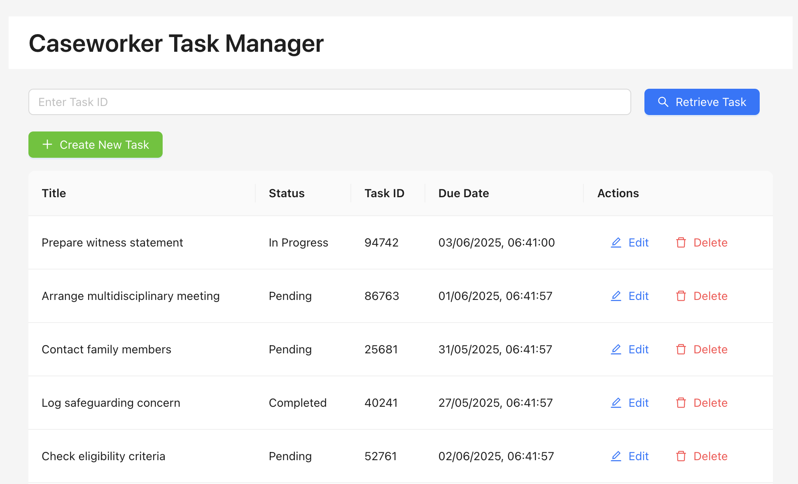

```markdown
# Task Manager API Documentation

## Base URL
```




## Full documentation at 
[https://documenter.getpostman.com/view/40516603/2sB2qfAKRw](http://localhost:8000/api/tasks/)

````
---

## Endpoints

### 1. Get All Tasks
- **URL:** `/`
- **Method:** GET
- **Description:** Retrieves a list of all tasks.
- **Response:**
```json
[
  {
    "id": 1,
    "title": "Task title",
    "description": "Task description",
    "status": "todo",
    "due_date": "2025-06-01T12:00:00Z",
    "task_id": "TASK123"
  }
]
````

* **Status Codes:**

  * 200 OK

---

### 2. Get Task by ID

* **URL:** `/{task_id}/`
* **Method:** GET
* **Description:** Retrieves details of a specific task by its `task_id`.
* **URL Params:**
  `task_id` — string (required)
* **Response:**

```json
{
  "id": 1,
  "title": "Task title",
  "description": "Task description",
  "status": "todo",
  "due_date": "2025-06-01T12:00:00Z",
  "task_id": "TASK123"
}
```

* **Status Codes:**

  * 200 OK
  * 404 Not Found — if task with given `task_id` does not exist

---

### 3. Create New Task

* **URL:** `/`
* **Method:** POST
* **Description:** Creates a new task.
* **Request Body:**

```json
{
  "title": "Task title",
  "description": "Task description",
  "status": "todo",
  "due_date": "2025-06-01T12:00:00Z"
}
```

* **Response:**

```json
{
  "id": 2,
  "title": "Task title",
  "description": "Task description",
  "status": "todo",
  "due_date": "2025-06-01T12:00:00Z",
  "task_id": "TASK124"
}
```

* **Status Codes:**

  * 201 Created
  * 400 Bad Request — if validation fails

---

### 4. Update Existing Task

* **URL:** `/{task_id}/`
* **Method:** PUT
* **Description:** Updates details of an existing task.
* **URL Params:**
  `task_id` — string (required)
* **Request Body:**

```json
{
  "title": "Updated task title",
  "description": "Updated description",
  "status": "in_progress",
  "due_date": "2025-07-01T12:00:00Z"
}
```

* **Response:**

```json
{
  "id": 1,
  "title": "Updated task title",
  "description": "Updated description",
  "status": "in_progress",
  "due_date": "2025-07-01T12:00:00Z",
  "task_id": "TASK123"
}
```

* **Status Codes:**

  * 200 OK
  * 400 Bad Request — if validation fails
  * 404 Not Found — if task with given `task_id` does not exist

---

### 5. Delete Task

* **URL:** `/{task_id}/`
* **Method:** DELETE
* **Description:** Deletes a task by `task_id`.
* **URL Params:**
  `task_id` — string (required)
* **Response:** No content
* **Status Codes:**

  * 204 No Content
  * 404 Not Found — if task with given `task_id` does not exist

---

# Running the Project Locally

## Prerequisites

* Python 3.8+
* Node.js and npm
* PostgreSQL or SQLite (for development)
* Git

---

## Backend Setup (Django REST Framework)

1. Clone the repository:

```bash
git clone https://github.com/yourusername/task-manager.git
cd task-manager/backend
```

2. Create and activate a virtual environment:

```bash
python -m venv venv
source venv/bin/activate   # Windows: venv\Scripts\activate
```

3. Install Python dependencies:

```bash
pip install -r requirements.txt
```

4. Configure your database settings in `settings.py` (default uses SQLite).

5. Run migrations:

```bash
python manage.py migrate
```

6. (Optional) Create a superuser:

```bash
python manage.py createsuperuser
```

7. Run the backend server:

```bash
python manage.py runserver
```

---

## Frontend Setup (React + Ant Design)

1. Navigate to the frontend directory:

```bash
cd ../frontend
```

2. Install dependencies:

```bash
npm install
```

3. Start the frontend development server:

```bash
npm start
```

4. Access the React app at [http://localhost:3000](http://localhost:3000)

---

## Usage

* Use the React frontend to manage tasks (create, update, delete, search).
* The backend API runs at `http://localhost:8000/api/tasks/`.
* API can also be tested using Postman or other REST clients.

---

## Running Tests

* Backend tests:

```bash
python manage.py test
```

* Frontend tests (if configured):

```bash
npm test
```

---

## Notes

* Make sure the backend server is running before the frontend to avoid connection issues.
* All API requests validate fields like `title`, `status`, `due_date`, and `task_id`.
* Customize environment variables or config files as needed.

---
